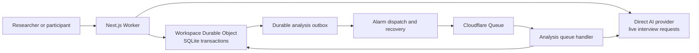

# Cloudflare migration plan — 23 September 2026

Status: reviewed architecture, accepted for implementation specification. The [complete Claude implementation package](cloudflare-migration/README.md) now owns the detailed build contracts and takes precedence where it refines this overview. No application changes, installs, credentials, database reads, provisioning, purchases, or deployment performed in this planning work. Source baseline: `4d3076528681862cda21d0b2c80d1ae2ce9faeda`.

## Outcome and scope

Move the current standalone deployment from Vercel plus Upstash to Cloudflare Workers with native Cloudflare storage. Preserve the researcher and participant journeys, immutable transcripts, consent authority, study revisions, model provenance, and safe recovery after failures.

The accepted implementation scope is **standalone first**. The existing hosted BYOS and Redis deployment options remain supported in the repository. The new Cloudflare deployment must operate without Upstash credentials or Redis requests. Removing Redis support from every product mode would additionally change hosted researchers' storage ownership, onboarding, encrypted connections, account deletion, and reconciliation. That is a separate product decision, not a dependency-cleanup step.

The proposed support matrix is deliberately bounded:

| Runtime | Product mode | Storage | AI transport | Migration treatment |
| --- | --- | --- | --- | --- |
| Existing Node/Vercel | Standalone | Redis | Direct or existing Gateway configuration | Continue current support and gates |
| Existing Node/Vercel | Hosted | Platform Redis plus researcher BYOS Redis | Direct | Continue current support and gates |
| Cloudflare Workers | Standalone | SQLite workspace DO | Direct | New deployment target |

Setup/readiness must reject combinations outside this matrix rather than infer a fallback. Gateway retains its existing authentication requirements; its inclusion in the old runtime is not a promise of Gateway/OIDC on Workers. Select capabilities centrally, not through scattered backend checks in routes. Existing options remain a product commitment until a separate deprecation decision; retiring this deployment's resources does not remove repository support. The detailed specification fixes this boundary before the shared storage refactor.

Xule accepted the standalone-first recommendation for Claude's implementation. Clean start versus preserving existing records remains an operational decision. Xule reports that Upstash has barely been used; this is not an inventory or deletion instruction. Prepare both data paths and preserve the old database until that decision is made. Local implementation does not depend on resolving it.

Earlier same-day metadata established that the canonical deployment uses standalone mode and direct provider transport. Database contents and account-wide Cloudflare usage were not inspected. See the [dependency investigation](2026-09-23-upstash-inactivity.md). Refresh deployment metadata before eventual cutover; this plan is not a live production-health claim.

## Recommended architecture

| Concern | Proposed choice | Reason |
| --- | --- | --- |
| Web application | Next.js on Workers; test OpenNext first | Preserve the existing application and avoid combining the migration with a framework rewrite |
| Authoritative research storage | One SQLite-backed `WorkspaceStore` Durable Object per standalone workspace | Short transactions can read, validate, branch, and write together, matching current authority and idempotency requirements |
| Deferred analysis | Durable outbox in workspace storage; Cloudflare Queue and a dedicated queue handler | Provider calls can outlive the HTTP response without holding the storage object busy |
| Outbox recovery and expiry housekeeping | One DO alarm scheduling the next due task | Recover dispatch without browser traffic; expiry remains enforced in reads, independently of cleanup |
| AI | Existing direct provider adapters | Preserve study-selected models, privacy options, validation, and actual execution provenance |
| Secrets | Cloudflare deployment secrets; local fixtures for tests | Separate environments and retain independent signing purposes |
| Recovery | DO point-in-time recovery plus a versioned operational export/import format | Test both restoration and portability; interview ZIP alone is not a full backup |

The outbox and alarm state belong to the same workspace object. The diagram separates responsibilities, not deployment bundles. Prefer one deployable Worker with an OpenNext fetch handler, a separate queue-event handler, and an exported workspace DO class. Queue execution remains independent of the HTTP response; provider calls remain outside the storage object. Analysis messages contain only internal job/workspace identifiers and a generation, never transcripts, opaque participant codes, or keys. The consumer loads authorized state through its DO binding.

OpenNext documents custom entrypoints that delegate fetch and add handlers or DO exports; Cloudflare allows one Worker to produce and consume Queue messages. This is a supported composition to prototype, not a validated build of this app. Test handler composition, bindings/secrets outside Next's request context, DO migrations, bundle limits, and concurrent HTTP/Queue behavior. Keep separate deployed Workers as a fallback for a demonstrated constraint. [OpenNext custom Worker](https://opennext.js.org/cloudflare/howtos/custom-worker) · [Queue JavaScript APIs](https://developers.cloudflare.com/queues/configuration/javascript-apis/)

### Why this storage choice

SQLite DO transactions are the best initial match for the current dynamic validation and conditional writes. The workspace is the coordination boundary because lists, create receipts, and admission budgets currently span studies. This is not one global object for all future customers. Use a stable server-owned identity and separate namespaces for local, staging, and production.

Disable production Version URLs and unneeded branch previews initially. A version upload can expose code against that version's configured resources before promotion. For any enabled test deployment, verify storage, Queue, secrets, and fixtures are isolated. Cloudflare's branch Previews can automatically isolate same-Worker DO storage, but Queue producer names still select shared account resources; that feature is distinct from Version URLs. Test that preview/unpromoted code cannot write production records or enqueue production jobs. [Version URL resource behavior](https://developers.cloudflare.com/workers/ci-cd/builds/#disconnecting-builds) · [Preview resource isolation](https://developers.cloudflare.com/workers/previews/resources/)

D1 is a credible alternative: it has transactional batches and better built-in operator query/import/export tooling. Its prebuilt SQL batches require a different expression of the current branching operations. Reconsider D1 if the prototype shows that DO operational tooling or workspace limits outweigh the transaction benefits. Do not introduce both D1 and DO for the same authoritative records initially; that adds another consistency boundary. Workers KV is unsuitable for these authoritative operations because it lacks the required transaction guarantees. [D1 API](https://developers.cloudflare.com/d1/worker-api/d1-database/) · [DO storage API](https://developers.cloudflare.com/durable-objects/api/sqlite-storage-api/) · [KV consistency](https://developers.cloudflare.com/kv/concepts/how-kv-works/)

Current paid SQLite DO limits include 10 GB per object and 2 MB per SQL row/string/BLOB. The per-object throughput guideline is not measured application capacity. Existing participant save requests are bounded at 512,000 bytes and synthesis at 256,000 bytes; test the maximum assembled record and measure imports rather than assuming every legacy record fits. No transcript chunking is proposed unless the measured bounds require it. [DO limits](https://developers.cloudflare.com/durable-objects/platform/limits/)

### Runtime decision to prove first

The lockfile targets Next 16.3.4 and React 19.3.0. Existing local dependencies do not exactly match the lockfile, so the future spike starts with `npm ci` under Node 24.19+ in an isolated checkout. Do not diagnose compatibility from the current installed tree.

Cloudflare now recommends vinext, but labels it beta. OpenNext supports Next 16; its recent proxy support still needs concrete verification with this application's `src/proxy.ts`. Prefer a pinned OpenNext feasibility spike, including its generated production Worker. If authentication/proxy compatibility fails, record the exact failure and compare supported fixes with vinext before broad implementation. Neither route is considered validated by this planning pass. [Cloudflare Next.js guide](https://developers.cloudflare.com/workers/framework-guides/web-apps/nextjs/) · [OpenNext](https://opennext.js.org/cloudflare) · [OpenNext releases](https://github.com/opennextjs/opennextjs-cloudflare/releases)

## Self-host deployment experience

Easy installation is a migration requirement, added after Xule's follow-up. Ship a tested **Deploy to Cloudflare** path in the README and self-host page, plus an optional agent setup skill backed by the same checked-in commands.

The official button clones a public GitHub/GitLab repository, collects configuration/secrets, builds, deploys, and provisions supported resources including DOs and Queues. It supports custom build/deploy scripts, but does not deploy multiple Worker applications from a monorepo together. The single-Worker packaging above avoids that documented limitation; actual template provisioning remains an acceptance test. [Deploy button documentation](https://developers.cloudflare.com/workers/platform/deploy-buttons/)

The intended journey is: sign in to Cloudflare and the Git provider, name the installation, supply one chosen provider key and application secrets, deploy, then open the ready workspace. State the plan requirements/costs before setup. Do not require an Upstash account or all four provider keys. Give every installation independent secret values; reject blank/placeholders rather than shipping shared template credentials.

Provide a Cloudflare-specific safe example and binding descriptions so the button does not accidentally request the existing Redis/hosted environment fields. Verify how the dashboard discovers the example and distinguishes optional provider keys. Obtain the actual canonical URL from authenticated deployment metadata or an explicit user-supplied origin; configure `APP_BASE_URL` before declaring the workspace ready. A generated stable `workers.dev` URL may be sufficient for a self-host installation, with a custom domain optional. Never infer authority from arbitrary request Host headers or copy our deployment's URL into a template. If this needs a second deployment, automate it where supported or document the remaining step honestly.

The proposed skill is a thin guide for an agent with CLI access: confirm target account and install/update intent, run the checked-in setup/preflight commands, generate independent secrets securely, configure bindings and origin, deploy, and verify readiness and version. Use non-destructive, repeatable scripts with explicit partial-install recovery; keep credentials out of arguments/logs/repository files. Account authentication and user-supplied provider credentials remain necessary. The skill must not maintain a separate deployment implementation or silently update an existing installation while handling a fresh-install request. No skill or installer is being created in this planning pass.

Acceptance: start without any app resources, customize names, complete the selected-provider/origin flow, verify DO initialization, Queue consumer and recovery queue, run a synthetic save-analysis-export, deploy again without duplicate resources, and recover a deliberately interrupted setup. Publish the button only after this path passes. If one-button setup has a real platform limitation, retain the safe architecture and provide a clearly described guided installer/agent path; do not label a partially deployed app ready.

Installation must also establish one owner for subsequent deployments. For this project's production instance, propose a CI promotion job dependent on all required checks for the exact commit/artifact, with competing push-to-deploy paths disabled. Button installations need a checked-in validation/build/deploy path whose failure prevents promotion; prove it works in Workers Builds or document a tested gated update path before advertising easy updates. Independent GitHub checks do not automatically gate Cloudflare's push-triggered deployment. Rehearse a deliberately failing check and verify production remains unchanged. [Cloudflare Git integration](https://developers.cloudflare.com/workers/ci-cd/builds/git-integration/)

## Storage contract and schema

Create a backend-neutral domain interface instead of implementing Redis commands or Lua on Cloudflare. Route handlers retain HTTP/authentication translation; complete storage operations own mutable authority checks and transactional writes.

| Operation family | Required contract |
| --- | --- |
| Study creation and edits | Stable operation key and fingerprint; expected revision; replay or conflict; edits invalidate old participant authority |
| Links and consent | Resolve/revoke links; consent bound to session, revision, and hash; enforce expiry at access time |
| Request admission | Atomic budgets; bounded identities; consistent time-window handling |
| Completion | Recheck study/link/consent, save immutable submission, update indexes/counts, consume budget once, and create the analysis job together |
| Analysis | Conditional claim; attempts and lease; fenced completion/failure; unchanged-record corruption outcome |
| Read, aggregate, and export | Bounded queries, explicit unavailable/corrupt outcomes, provenance preserved, no successful empty result on storage failure |

Retain meaningful outcomes such as `duplicate`, `conflict`, `revision-stale`, `busy`, `stale`, `corrupt`, `unavailable`, and an unknown-commit result where needed. SQL atomicity does not prove the caller received a committed response. Replays must discover the original result.

Request admission also needs a runtime-specific client identity boundary. Today's limiter prefers Vercel headers and the leftmost forwarded address; copying that selector to Workers could trust caller-supplied values. Normalize identity at the trusted Cloudflare entrypoint, with explicit missing-header, Worker-subrequest and IPv6 behavior; shared application code receives only that established identity. Do not add another header to an unqualified fallback chain. Preserve salted identities and the independent session/link/study budgets. Test conflicting Vercel/XFF/Cloudflare headers and strip any client-supplied internal identity header. [Cloudflare header behavior](https://developers.cloudflare.com/fundamentals/reference/http-headers/)

Proposed indexed tables: `studies`, `interviews`, `analysis`, `aggregates`, `participant_links`, `consents`, `idempotency_receipts`, budget windows/members, `analysis_jobs`, and a schema-migration ledger. Keep rich research documents as JSON, with identity, revision, status, expiry, and lookup fields in typed columns. Separate immutable interview content from mutable analysis. SQL constraints protect new writes; imports still need explicit validation.

Keep Redis internals behind the existing backend: Lua, wire tags, and Redis crash-repair guards continue to support its deployments. The Cloudflare backend can collapse standalone multi-command recovery protocols into real transactions while preserving externally observable outcomes. Do not copy implementation-specific guards merely to make identical tests pass.

Use explicit `expires_at` checks for links, consent, receipts, and limits. Cleanup never grants authority. Preserve existing lifetimes and original timestamps on replay; imports do not renew them. Bound each cleanup batch and combine all due tasks under the object's single alarm. Provider I/O must never run inside a SQL transaction or `blockConcurrencyWhile`.

## Durable analysis and paid-call behavior

The current save route uses Next `after()` and a 120-second function duration. Workers HTTP background execution is limited to 30 seconds after response/disconnection. Raising CPU limits does not extend that background window. Queue consumers permit longer wall time, but delivery is at least once. [Workers invocation limits](https://developers.cloudflare.com/workers/platform/limits/) · [Queues limits](https://developers.cloudflare.com/queues/platform/limits/) · [Delivery guarantees](https://developers.cloudflare.com/queues/reference/delivery-guarantees/)

The proposed protocol is:

1. In the save transaction, create one immutable transcript and one stable initial analysis job/outbox entry. Bind each generation to an immutable server-owned study configuration/revision and resolved requested provider/model: the initial generation uses the save-time configuration; a later eligible researcher retry uses the configuration at that action's acceptance. Read secrets at execution time, never into the job. Every committed nonterminal job must already have a durable future recovery path; acknowledgement timing alone is insufficient. Prove the supported transaction/alarm mechanism in the prototype, including a crash after transcript/job commit but before alarm registration and duplicate-save replay. Do not depend on a later browser request to discover stranded work.
2. An alarm dispatches identifiers to the Queue, then marks dispatch. A lost queue acknowledgement may cause a duplicate; it must not cause another model call. Pending jobs remain authoritative in SQLite even if queue retention expires.
3. The consumer conditionally claims the job generation and persists its claim and provider-started state before calling the provider. Reload the job's frozen inputs and check current existence/cancellation; never substitute the study's latest configuration. Use bounded consumer concurrency and small batches initially.
4. The provider call happens outside the storage object. On return, attach a result only for the matching generation/claim, recording that generation's revision and the provider's actual execution provenance. A stale worker cannot attach success or record failure over a newer attempt. Later study edits must not relabel or silently change queued work.
5. A recorded provider failure ends that job generation and acknowledges delivery. Retry dispatch/storage faults only where doing so cannot repeat a paid call. An eligible explicit researcher retry creates a new generation; duplicate delivery of an old generation is a no-op.
6. If execution dies after the provider-started marker and the result is unknown, mark the job as requiring researcher recovery when its deadline expires. Do not automatically issue another paid call. This may need a small researcher-facing explanation while preserving the existing retry workflow.

The current claim lease is 180 seconds against a synthesis deadline of 120 seconds. Prove deadline, SDK retries, abort, and result-attachment margin together. A lease expiry alone is not evidence that the provider was never called. Exactly-once provider billing is not promised; the durable marker can prevent automatic repeats but can also leave a conservatively uncertain attempt that never reached the provider.

Transport recovery is distinct from provider retry. Pending-dispatch jobs need a recovery alarm; dispatched-but-unfinished jobs need a watchdog and terminal/recovery policy. Terminal failures must not be re-enqueued indefinitely. Define dead-letter inspection, queue expiry reconciliation, and acknowledgement rules before enabling the consumer. Alarm retries are finite, so application recovery must not depend solely on the platform's retry count. [DO alarms](https://developers.cloudflare.com/durable-objects/api/alarms/)

Generation allocation is itself atomic: keep at most one pending/running generation per interview. Different request keys racing from two tabs, batch/detail actions, or the automatic initial job return the existing active job; completed analysis returns already-complete. Allocate a new generation only from an explicitly retry-eligible terminal/recovery state. Request-key deduplication alone is insufficient. Unknown provider execution remains an explicit recovery decision, not evidence that an earlier paid request has stopped.

Define terminal job and request-receipt retention against the supported replay window. Missing/cancelled/deleted jobs are acknowledged without a provider call; Queue delivery can never recreate work. Cleanup cannot make an old identifier valid again or erase the durable evidence used to decide whether an attempt may run.

Researcher retry should enter the same durable job path on Cloudflare. Plan an explicit accepted/pending response and bounded status polling in `src/services/analysisApi.ts` and the researcher screens; the existing Redis path may continue returning its synchronous result. Preserve the batch rule: stop on a request/storage failure, continue after a durably recorded provider failure. One researcher action creates one intended generation, with an idempotency key so a lost HTTP response cannot create a second generation. Document the additive API response and test old and new clients; do not silently reinterpret an existing success response as completed analysis.

## Implementation sequence and exit gates

| Step | Deliverable | Exit gate |
| --- | --- | --- |
| 1. Runtime feasibility | Isolated clean install; pinned adapter/custom entrypoint; public/auth routes; trusted client identity; minimal local DO transaction and Queue delivery probes; provider SDK fixtures | One production Worker artifact handles fetch, queue events and DO exports in `workerd`; proxy/cookies, identity, crypto, SDKs, assets and bindings work within limits; this is not yet a complete research workflow |
| 2. Storage boundary and vertical slice | Domain interface and Redis implementation; SQLite DO schema; synthetic study/link/consent/save/claim/attach/read path | Shared behavioral scenarios pass on both backends; concurrent saves/claims, expiry and response-loss cases preserve invariants; persisted state survives runtime restart |
| 3. Durable jobs and full application | Outbox, Queue consumer, recovery scheduler; researcher retry polling; all standalone routes on the domain interface; setup/readiness selection | Full synthetic browser journey saves before analysis; closing the tab does not abandon work; duplicate delivery cannot repeat terminal jobs; Cloudflare works without Redis credentials or requests |
| 4. Operational readiness | Production-artifact browser lane, export memory fixes, schema upgrades, recovery tooling, deploy-button template, setup commands/skill, operator instructions, CI | Full supported matrix passes; fresh-install/update/recovery and synthetic staging/restore/cutover rehearsals demonstrate the actual deployed behavior |
| 5. Production transition | Chosen origin, data disposition, drain/write fence, final verification, one writable backend | Accepted data set is complete; new end-to-end research works; old origin cannot keep writing; rollback limitations recorded |
| 6. Retirement | Remove this deployment's Upstash connection and obsolete Vercel application resources after acceptance | No active dependency or required data remains; any redirect-only old origin has an explicit owner and lifetime |

Implementation may parallelize storage and runtime work after the domain contract is agreed. One owner integrates shared route/config changes. Tests follow the new contracts concurrently. Avoid multiple agents independently rewriting `kv.ts`, request contexts, or save/analysis routes. Review and land small coherent changes; a production release waits for the full sequence's gates.

### Test strategy

Retain `npm run check`, setup tests, standalone direct/Gateway and hosted fixture builds, existing browser journeys, Redis crash tests, and hosted adversarial tests while those deployment options remain supported. Add a separate Cloudflare runtime suite and production-build browser launcher.

Current official guidance uses `@cloudflare/vitest-plugin`, running locally in `workerd` with per-test-file storage isolation. Use unique runner-owned persistence directories and explicit reset within a test file. Restart tests reopen only their own directory. The production-build integration harness or the adapter's production preview must exercise actual local bindings; synthesize only provider HTTP. Reject inherited provider credentials, dotenv secrets, remote bindings, and unexpected outbound network traffic. [Workers testing](https://developers.cloudflare.com/workers/testing/vitest-integration/) · [Production-build test harness](https://developers.cloudflare.com/workers/testing/test-harness/)

Required regressions:

- Wrong audience/session/tab/study authority causes no provider call or write; researcher preview remains non-persistent.
- Spoofed forwarding headers cannot rotate the client budget identity; missing/IPv6/subrequest behavior follows the selected runtime policy.
- Missing, stale, expired, or unavailable consent/revision/link fails closed, including edits/revocation racing a save.
- Identical concurrent saves create one transcript, count, budget consumption, and job; changed-payload replay conflicts.
- Failure before commit and lost response after commit yield distinct safe outcomes on retry.
- Analysis delivery, researcher retry, lease expiry, crash before/after provider start, lost attach acknowledgement, and late completion preserve generation fencing and bounded paid-call behavior.
- Different retry keys racing the initial generation produce one active job; edits before claim or attach preserve frozen analysis inputs/revision; delayed delivery cannot resurrect deleted work.
- Corrupt records remain unchanged; legacy absence of analysis and valid old shapes retain their supported semantics.
- Expiry and schema migration survive restart; unsupported schema refuses readiness; interrupted upgrades are recoverable.
- Exports preserve Unicode, empty arrays/objects, consent, pending analysis, and provenance; formula safety and tenancy boundaries remain intact.
- Largest valid payloads, bulk lists, aggregate inputs, and exports run under actual Worker memory and binding limits.
- The demo makes no API, provider, or persistence request; missing Cloudflare bindings never select a hidden Redis fallback.
- Unsupported deployment combinations refuse setup/readiness; preview/version endpoints cannot mutate production; a failed release check prevents promotion.
- A compatible N−1 → N → N−1 update with pending work preserves schema, job processing and records; class lifecycle changes use their separately rehearsed recovery procedure.

The current server export builds a ZIP in memory and can load 500 interviews. Replace whole-collection materialization with bounded reads and a streaming export path if needed; preserve download format and avoid quietly reducing the supported dataset. Read consistency must be defined across a paginated export while analysis changes. An interrupted stream must not be presented as a complete backup. Recovery/export tools need a versioned manifest and counts/checksums, not just a plausible ZIP.

## Production data, origin, and rollback

No production record access belongs to this planning pass. During the approved migration, first establish a bounded, metadata-only inventory: counts by record family, schema, sizes, and pending analysis/operations, without logging participant bodies, study names, keys, or link codes. Cover orphan records rather than relying only on indexes. Credential access follows the repository's explicit-request rule.

Two data paths:

- **Clean start:** after confirming there is nothing to retain, initialize an empty Cloudflare workspace. Do not build an elaborate historical importer unnecessarily. Existing study/participant links must either remain usable by a chosen preservation path or be deliberately retired. Keep Upstash unchanged until the retirement decision.
- **Preserve records:** export operational state under controlled access into an agreed secure destination; validate a versioned manifest before import. Preserve IDs, revisions, timestamps, links, consent evidence, fingerprints, rate/receipt lifetimes, transcripts, analyses, and provenance. Reject/report corrupt or oversized entries without silently truncating or repairing them. Unfinished jobs need explicit reconciliation, not copying stale running claims. Rehearse with synthetic records first.

The application ZIP is a researcher export, not a complete database backup. Do not upload real records as staging fixtures or retain participant content in repository files, logs, or test results.

Choose a stable Cloudflare-controlled custom hostname before production secrets and participant links are issued. `openinterviewer.vercel.app` cannot be transferred through Cloudflare DNS. A redirect-only Vercel deployment can preserve old landing and `/p/...` entry paths when corresponding link records are preserved; it must not redirect in-flight mutation requests or keep writing to old storage. Host-only cookies do not transfer: researchers sign in again and participants re-enter through valid links. Do not switch while an active participant has unsaved browser-only answers.

Add a two-stage collection drain if existing sessions/data require continuity: stop new link exchanges/starts while allowing established sessions to finish; then fence all mutations and background analysis before the final inventory/snapshot. Simply disabling links would also reject established participants. Rehearse the write fence; both public origins must never independently accept research writes during transition.

The fence must cover old immutable Vercel deployment URLs, aliases, and already-running `after()` callbacks, not just the canonical hostname or a newly deployed maintenance flag. Establish a tested barrier at the old writers' storage access or disable every writer; verify that no late write can commit after the final snapshot. Retain a controlled read/export path if preservation requires it. The concrete access change belongs to the cutover runbook, not this planning pass.

Before the first Cloudflare production write, reverting to the untouched old deployment/data is possible only if the old service is still available. The current Upstash archival warning means availability cannot be assumed. After the first Cloudflare write, switching DNS or code back to stale Redis is not a safe data rollback. Prefer a previous compatible Cloudflare application version or roll forward. Returning to Redis requires a tested reverse migration or an explicitly accepted data disposition. Do not build a reverse importer by default for an empty-start deployment.

Record a tested rollback target for each release. Separate code-only changes, SQLite schema upgrades, and DO class/namespace lifecycle changes: native Worker rollback can be blocked by lifecycle changes or deleted bound resources, and does not restore stored data. Keep schemas/job protocols compatible with the preceding version during the rollback window and retain required resources. Treat lifecycle-changing releases as forward-fix unless a separate recovery procedure has passed rehearsal. [Worker rollback limits](https://developers.cloudflare.com/workers/versions-and-deployments/rollbacks/#bindings)

Proposed storage placement is the EU jurisdiction, selected before object creation. This restricts DO execution/storage, not all edge processing, logs, Queue metadata, or provider inference. Preserve provider privacy settings and update the operator-facing storage description. [DO data location](https://developers.cloudflare.com/durable-objects/reference/data-location/)

Cloudflare provides 30-day DO point-in-time recovery, but that API is not available in local development. Rehearse restoration in a disposable synthetic staging object. Also prove versioned export/import to a fresh workspace, and agree where protected backups will be retained. A storage restore does not rewind a Queue or undo provider calls. Suspend dispatch/consumption for restoration, reject old deliveries with a recovery epoch outside the restored database, and explicitly reconcile restored nonterminal jobs before resuming them: their provider-started markers may have been rewound. [DO recovery](https://developers.cloudflare.com/durable-objects/api/sqlite-storage-api/#pitr-point-in-time-recovery-api)

## Cost and operational checks

Workers Paid is account-wide. Incremental costs can remain within the existing subscription allowances, but this account's remaining capacity is unverified. Track Workers requests/CPU, DO requests/duration/storage, Queue operations, and any adapter cache storage or build charges. Keep model charges separate. Provider calls outside the DO avoid holding its billable lifetime open while waiting on inference. [Workers pricing](https://developers.cloudflare.com/workers/platform/pricing/) · [DO pricing](https://developers.cloudflare.com/durable-objects/platform/pricing/)

Queues currently include one million operations monthly on Workers Paid; a usual delivery uses write/read/delete, with retries adding operations. Configure small messages and bounded concurrency; pending work remains in the outbox beyond transport retention. R2 is optional for adapter cache or protected backups if justified by the chosen build/recovery design, not an additional authoritative research store by default. [Queue pricing](https://developers.cloudflare.com/queues/platform/pricing/)

Before production, resolve: scope and data choice; Cloudflare account and desired hostname; initial region; account usage headroom; actual adapter bundle compatibility; backup destination/retention; old-origin redirect lifetime; and the precisely scoped live-provider validation. Local synthetic tests cannot prove real provider compatibility. Do not fetch keys or make paid smoke calls until the provider and call budget are explicitly authorized.

## Source anchors and verification status

The investigation used three independent lanes: storage architecture, runtime/background work, and testing/cutover, followed by an independent review of the draft plan. That review tightened the milestone boundaries, asynchronous retry contract, durable wake-up invariant, and coverage of the old deployment write fence.

A subsequent three-agent critique checked architecture/scope, analysis jobs, and operations. Its seven accepted findings now appear above: trusted request identity, the supported deployment matrix, frozen job inputs, active-generation exclusion, preview isolation, enforced promotion, and platform rollback limits. See the [review and adjudication](2026-09-23-cloudflare-plan-review.md). These are planning corrections, not implemented protections.

Principal code anchors:

- `src/lib/redisPort.ts`: Redis-specific adapter boundary that should remain inside the Redis backend.
- `src/lib/kv.ts`: atomic completion, idempotency, analysis claims and corruption outcomes.
- `src/lib/researcherContext.ts`, `src/lib/kvClient.ts`: standalone versus hosted BYOS selection.
- `src/app/api/interviews/save/route.ts`: save-first persistence and post-response analysis.
- `src/lib/providerErrors.ts`, `src/lib/providers/`: deadlines, native adapters, safe failure handling.
- `src/app/api/interviews/export/route.ts`: current server ZIP and collection materialization.
- `src/lib/auth.ts`, `src/lib/appBaseUrl.ts`, `src/proxy.ts`: cookies, authority and canonical origin.
- `src/lib/rateLimit.ts`, `src/lib/platformAiRateLimit.ts`: current platform-header assumptions for client identity.
- `tests/integration/redis.crashCuts.test.ts`, `tests/unit/api.save.idempotent.test.ts`, `tests/unit/participantConsent.test.ts`: behavioral regression evidence.
- `tests/e2e/server.mjs`, `tests/e2e/workflow-fixture.ts`, `.github/workflows/ci.yml`: existing isolated verification infrastructure.

No application tests were run for this plan-only change. Implementation estimates remain provisional until the local compatibility and transaction/job prototype passes. No claim is made that the current app already builds or runs on Cloudflare.
